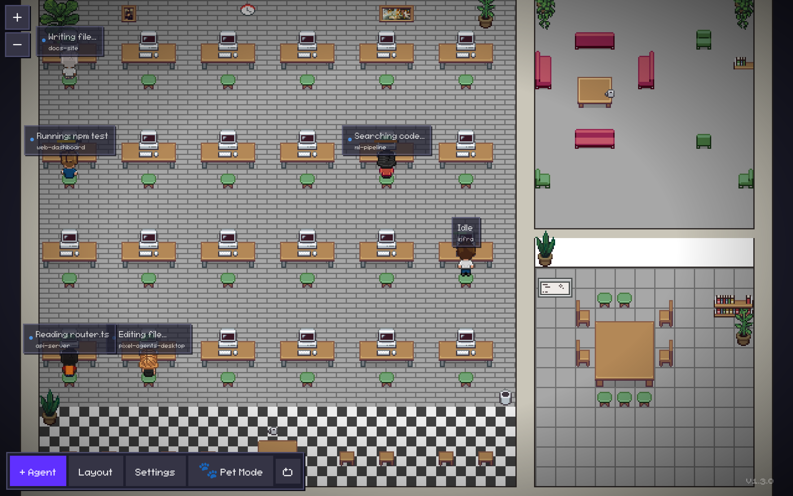
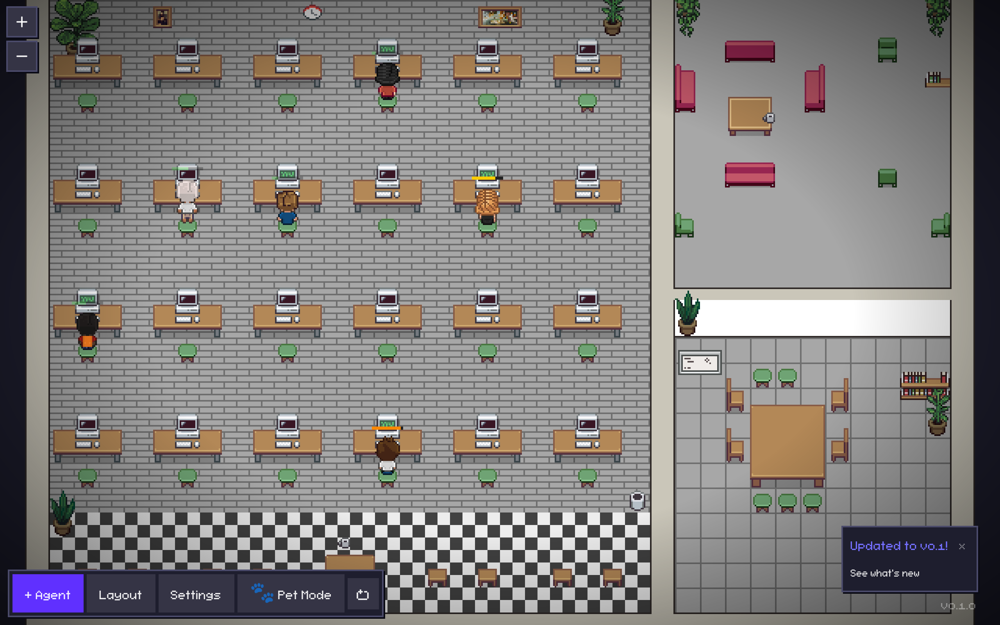
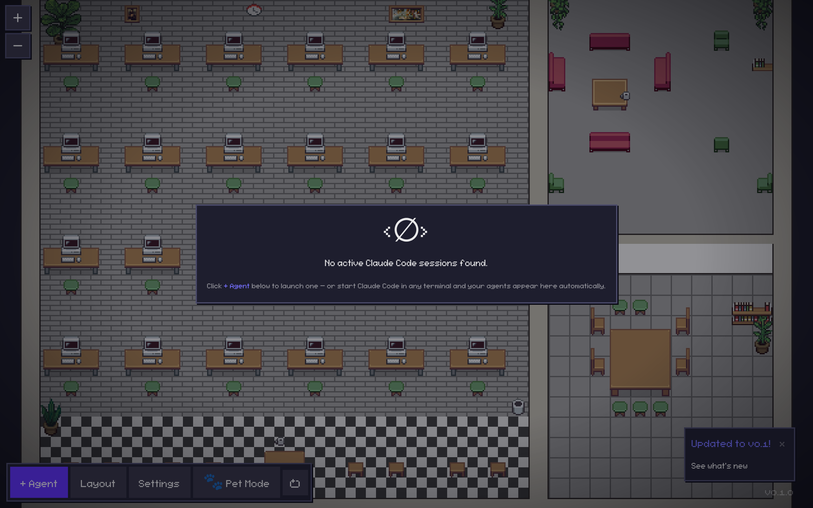

# Pixel Agents Desktop

Standalone desktop viewer for [Claude Code](https://claude.ai/code) sessions — built on top of [pablodelucca/pixel-agents](https://github.com/pablodelucca/pixel-agents).

Watch your Claude Code agents animate as pixel-art characters in a virtual office, without needing VS Code. It's a hobby tool, not a SaaS — have fun with it.

## Screenshots

Each active Claude Code session becomes a character at a desk, with a live label of what it's doing right now and a token-usage health bar above its head:



Token health bars (green → yellow → orange) show each agent's context-window usage at a glance:



When there are no sessions yet, the office guides you to launch one:



## Features

- **Pixel-art office** with animated characters, one per active Claude Code agent
- **Pet Mode** — a tiny always-on-top mini-window with a single agent, perfect for the corner of your screen
- **Token Health Bar** above each character, showing context-window usage with hysteresis-smoothed bubbles
- **Native OS notifications** when an agent needs your attention
- **System tray** with a live agent count and a Pet Mode toggle
- **Global hotkey** `Ctrl+Shift+P` to show/hide the main window
- **Custom sprite packs** — drop a folder into `~/.pixel-agents/sprites/` and pick it from settings
- **Persistent layout & settings** — window position, character placement, and preferences survive restarts
- **JSONL replay** at startup (30s lookback) so re-opening the app shows recent activity
- **Claude Code Hooks integration** — optional local HTTP endpoint that lets Claude Code push tool-use events directly to the app

## Requirements

- **Windows 10/11** with WebView2 (the installer bootstraps WebView2 automatically; pre-installed on Windows 11)
- **macOS 10.15+** (Catalina or later)
- **Linux x64** with `webkit2gtk` (most modern distros)
- Claude Code sessions at `~/.claude/projects/` (default location)

## Install

Download the latest installer from [Releases](https://github.com/santino18727-debug/pixel-agents-desktop/releases) and run it:

- Windows: `.msi` (enterprise) or `.exe` (NSIS, recommended)
- macOS: `.dmg`
- Linux: `.AppImage` or `.deb`

### Windows SmartScreen warning

The Windows binaries are **not code-signed** yet — this is a hobby project and a code-signing certificate costs a few hundred euros per year. When you run the installer, Windows SmartScreen will show:

> **Windows protected your PC** — Microsoft Defender SmartScreen prevented an unrecognized app from starting.

This is expected. To proceed:

1. Click **More info**
2. Click **Run anyway**

If you'd rather verify the binary before running it, you can:

- Check the SHA-256 hash against the one published on the [release page](https://github.com/santino18727-debug/pixel-agents-desktop/releases/latest)
- Build from source yourself (see the [Development](#development) section)

Code signing via Azure Trusted Signing is planned once the project stabilizes.

## Logs

Set `RUST_LOG=debug` before launching to get verbose logs from the Rust backend (file watcher, hooks server, settings store). Useful when reporting an issue.

```sh
# Windows PowerShell
$env:RUST_LOG="debug"; .\pixel-agents-desktop.exe

# macOS / Linux
RUST_LOG=debug ./pixel-agents-desktop
```

## Development

### Prerequisites

```
winget install Rustlang.Rustup   # or rustup.rs on macOS/Linux
node >= 22
```

### Run in dev mode

```sh
# Install dependencies
npm install
cd webview-ui && npm install && cd ..

# Start dev server + Tauri window
npm run dev
```

### Build

```sh
npm run build
# Bundle output: src-tauri/target/release/bundle/
```

### Tests

```sh
# Rust unit tests
cd src-tauri && cargo test

# Clippy (zero warnings policy)
cargo clippy -- -D warnings
```

## Architecture

```
src-tauri/src/
  main.rs              — entry point
  lib.rs               — Tauri app setup, command registration, tray, hotkeys
  error.rs             — AppError enum
  jsonl_parser.rs      — JSONL line parser, AgentEvent enum
  session_registry.rs  — Session discovery via walkdir
  file_watcher.rs      — notify-debouncer-full filesystem watcher
  hooks_server.rs      — Local HTTP server for Claude Code Hooks API
  settings.rs          — Persisted settings via tauri-plugin-store

webview-ui/            — React 19 + TypeScript + Vite (from upstream)
  src/vscode-shim.ts   — Tauri IPC bridge (replaces VS Code postMessage)

shared/                — Shared assets/utilities (from upstream)
```

## Dependencies & API Usage

Pixel Agents Desktop is a viewer for Claude Code sessions — it reads local session files written to `~/.claude/projects/` by the Claude Code CLI. It does **not** interact with the Anthropic API and does **not** require authentication. Built with Tauri v2, it parses Claude Code's internal JSONL session format to visualize agent activity in real-time. It is not affiliated with Anthropic and does not depend on the Anthropic SDK. All session data originates from local Claude Code runs; this app does not make API calls or send data to Anthropic's servers.

## Credits

This project is a Tauri v2 desktop fork of [pixel-agents](https://github.com/pablodelucca/pixel-agents) by **Pablo de Lucca**. The `webview-ui/` and `shared/` directories are derived from that work, used here under the terms of the MIT License.

- Original source: https://github.com/pablodelucca/pixel-agents
- Original author: Pablo de Lucca
- See [`LICENSE-UPSTREAM`](./LICENSE-UPSTREAM) for the upstream MIT license text.

Huge thanks to Pablo for the pixel-art aesthetic and the upstream React app that makes this thing fun.

## License

MIT — see [`LICENSE`](./LICENSE). Upstream license preserved in [`LICENSE-UPSTREAM`](./LICENSE-UPSTREAM).
