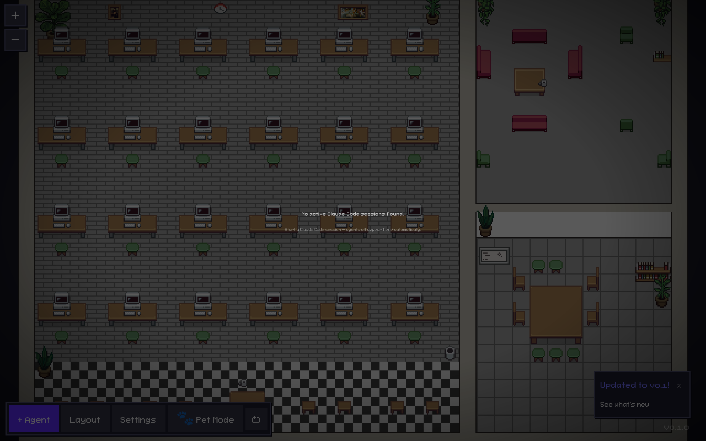
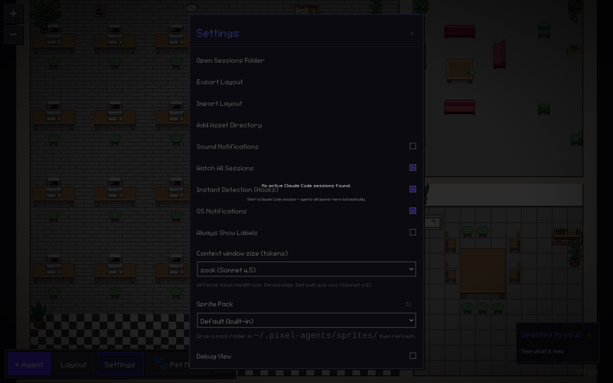
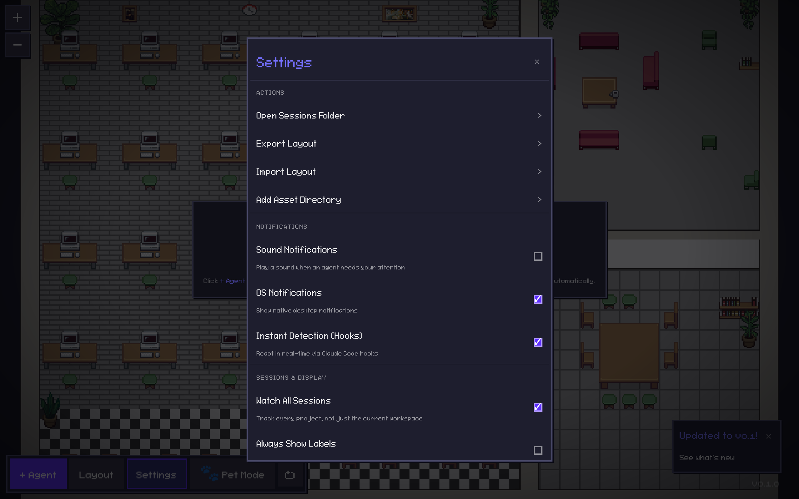

# Audit UI / UX / Réseau — Pixel Agents Desktop

> Audit mené sur `webview-ui` (React 19 + TypeScript + Tailwind v4) et la couche
> réseau backend (`src-tauri`). Améliorations sélectionnées via un **conseil de
> revue** à plusieurs points de vue (design visuel, accessibilité, front/perf/réseau,
> produit), puis implémentées.

---

## 1. Méthode

1. **Audit** — inspection visuelle de l'app (rendue en mode navigateur via le mock
   Vite) + lecture du code : état vide, modales, panneau Réglages, boucles de rendu,
   et le serveur HTTP des hooks Claude Code.
2. **Conseil (LLM council)** — 4 relectures parallèles, chacune avec une lentille
   distincte, notant chaque piste (Impact / Effort / Confiance) et votant DO / MAYBE / SKIP.
3. **Améliorations** — implémentation des pistes retenues par consensus.
4. **Captures d'écran** — avant / après (ci-dessous).

---

## 2. Résultat du conseil

| # | Piste | Visuel | A11y | Front/Perf | Produit | Décision |
|---|-------|:------:|:----:|:----------:|:-------:|----------|
| F1 | z-index de l'état vide passe **par-dessus** les modales | DO | DO | DO | DO | ✅ Corrigé |
| F2 | État vide : contraste faible, hors-charte, non actionnable | DO | DO | MAYBE | DO | ✅ Corrigé |
| F3 | Réglages sans regroupement visuel | DO | DO | MAYBE | MAYBE | ✅ Corrigé |
| F4 | Modale sans `max-height` / scroll (contenu coupé) | DO | DO | DO | DO | ✅ Corrigé |
| F5 | Modale : `role`/`aria`, Échap, gestion du focus manquants | MAYBE | DO | MAYBE | MAYBE | ✅ Corrigé |
| F6 | Serveur HTTP des hooks | SKIP | SKIP | SKIP | SKIP | ⏭️ Sain — rien à faire |
| N1 | `Checkbox` sans `role="switch"` / `aria-checked` | — | DO | — | — | ✅ Corrigé |
| N2 | Deux boucles `rAF` **toujours actives** (idle/minimisé) | — | — | DO | — | ✅ Corrigé |
| N3 | Menu « Skip permissions » ouvert au **survol** (footgun) | — | — | — | DO | ⏭️ Reporté (1 voix, change une interaction cœur) |

> **F6 — la couche réseau est solide.** Le serveur des hooks (`src-tauri/src/hooks_server.rs`,
> `127.0.0.1:17317`) fait déjà : comparaison de jeton en temps constant, validation
> de l'en-tête `Host` (anti DNS-rebinding), plafond de corps à 1 Mio, timeout de
> lecture de 30 s, repli de port. Aucun correctif nécessaire.

---

## 3. Améliorations appliquées

### F1 + F2 — État vide reconstruit
`webview-ui/src/components/NoAgentsOverlay.tsx`
- z-index abaissé (`100` → `30`) : le message ne peint plus par-dessus les modales.
- Carte `pixel-panel` (bordure + ombre dure), **police pixel** de l'app (au lieu de
  `monospace`), texte en plein contraste (`--color-text` au lieu de `#ccc` / opacité 0.55).
- Voile assombri allégé (`0.65` → `0.45`) : le bouton **+ Agent** reste bien visible.
- Texte désormais **actionnable** : pointe explicitement vers le bouton **+ Agent**.
- `role="status"` + `aria-live="polite"`.

### F4 + F5 — Modale robuste et accessible
`webview-ui/src/components/ui/Modal.tsx`, `webview-ui/src/index.css`
- `max-h-[85vh]` + `overflow-y-auto` (barre de défilement thématisée `.pixel-scroll`) :
  plus aucun réglage inaccessible sur petite fenêtre.
- `role="dialog"`, `aria-modal="true"`, `aria-labelledby` relié au titre.
- **Échap ferme** la modale ; **piège à focus** (Tab/Shift+Tab bouclent dans la boîte).
- Focus déplacé dans la modale à l'ouverture, **restauré sur le déclencheur** à la fermeture.
- Bouton de fermeture : glyphe `×` propre + `aria-label="Close"`.

### F3 — Panneau Réglages regroupé
`webview-ui/src/components/SettingsModal.tsx`
- Sections avec titres (`ACTIONS`, `NOTIFICATIONS`, `SESSIONS & DISPLAY`, `ADVANCED`)
  et séparateurs — vrais titres `<h3>` pour la navigation lecteur d'écran.
- Les lignes d'action portent un chevron `›` (les distingue des interrupteurs).
- Descriptions d'une ligne sous chaque option.
- `<label htmlFor>` reliés aux `<select>` ; `aria-label` sur le champ numérique.

### N1 — `Checkbox` accessible
`webview-ui/src/components/ui/Checkbox.tsx`
- `role="switch"` + `aria-checked` : l'état on/off est enfin annoncé.
- Marque `✓` au lieu d'un `x` littéral ; support d'une `description`.

### N2 — Boucles de rendu des overlays maîtrisées
`webview-ui/src/office/utils/overlayPositioning.ts` + `ToolOverlay.tsx` + `TokenHealthBar.tsx`
- La boucle `rAF` est **conditionnée** à la présence de personnages (`active`) **et**
  à la visibilité du document (`visibilitychange`).
- Un bureau vide ou une fenêtre minimisée ne fait plus tourner de boucle de re-render —
  gain de CPU/batterie pour une app conçue pour tourner en fond (« pet »).

---

## 4. Vérification

- `npm run build` (tsc + vite) : **OK** (le warning `pngjs` est préexistant et ne
  concerne que le repli de décodage PNG navigateur).
- Test de fumée a11y automatisé (Playwright) : `role=dialog` + `aria-modal` présents,
  `aria-labelledby` → « Settings », bouton de fermeture labellisé, 6 `role="switch"`
  avec `aria-checked`, **Échap ferme**, **focus restauré** sur le déclencheur. ✅
- `npm run lint` : non exécutable dans cet environnement — la config référence
  `eslint-rules/pixel-agents-rules.mjs`, non versionné dans le dépôt (problème
  préexistant, sans rapport avec ces changements).

---

## 5. Captures d'écran

### État vide (première impression)
| Avant | Après |
|-------|-------|
|  |  |

### Panneau Réglages
| Avant | Après |
|-------|-------|
|  |  |

> Sur l'« avant » des Réglages, on voit le texte « No active Claude Code sessions
> found » traverser la modale (bug F1). Sur l'« après », la carte d'état vide passe
> bien **derrière** la modale.
